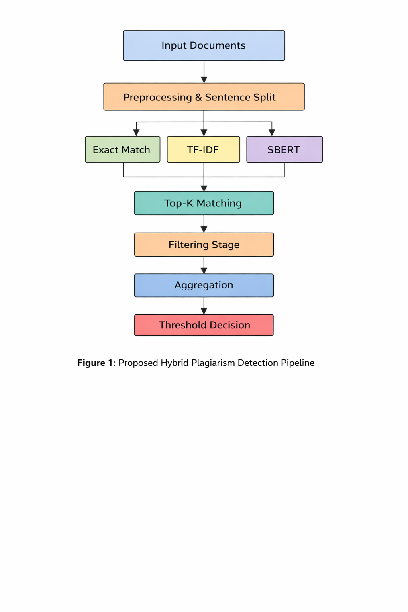
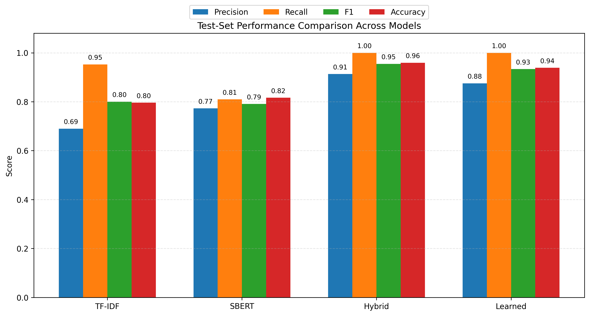
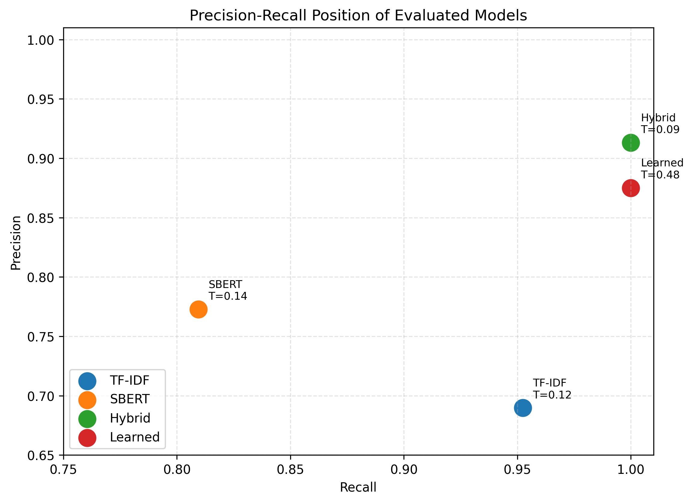
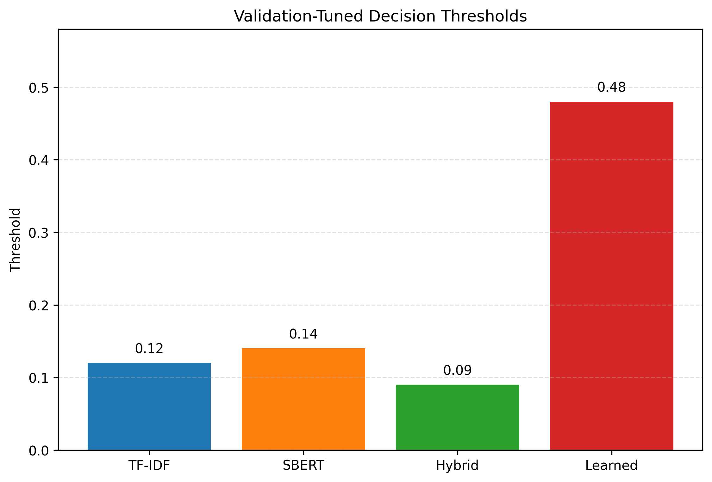
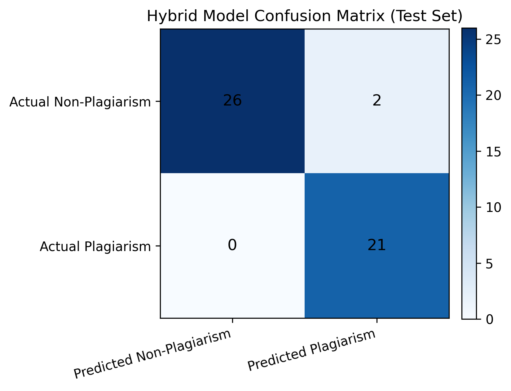

# Hybrid Multi-Stage Plagiarism Detection System

A research-oriented plagiarism detection system that combines exact matching, TF-IDF lexical similarity, and SBERT semantic similarity in a multi-stage hybrid pipeline.

## Overview

This project was built to address a common weakness in plagiarism detection systems:

* lexical methods are strong for copied text but weak for paraphrasing
* semantic methods can detect paraphrased meaning but may introduce false positives
* single-score systems often become unstable when document-level decisions depend on only one strong sentence match

To solve this, the project uses a hybrid design that combines:

* exact sentence matching
* document-level TF-IDF similarity
* document-level SBERT similarity
* top-K sentence candidate matching
* lexical-semantic filtering
* document-level ensemble aggregation

The result is a more balanced system that can detect both direct copying and semantically preserved rewriting.

---

## 🔥 System Pipeline



---

## Key Contributions

* Multi-stage hybrid plagiarism pipeline combining lexical and semantic evidence
* Top-K sentence matching to reduce noisy exhaustive comparisons
* Filtering mechanism to reject weak sentence pairs
* Document-level aggregation using both **local (sentence-level)** and **global (document-level)** signals
* Proper train-test evaluation with threshold tuning (no data leakage)
* Reproducible experiment runner with threshold tuning per model
* Learning-based logistic regression classifier over extracted hybrid features
* Ablation study for key hybrid components
* Bootstrap confidence intervals on held-out test metrics
* Updated research paper assets and generated result visualizations

---

## Project Structure

```text
plagarism_system/
├── data/
│   └── pan13/
├── experiments/
│   ├── plot_graphs.py
│   └── run_experiment.py
├── results/
│   └── comparison.json
├── src/
│   ├── aggregator.py
│   ├── evaluator.py
│   ├── exact_match.py
│   ├── pan_loader.py
│   ├── paraphrase.py
│   ├── pipeline.py
│   ├── preprocessing.py
│   └── semantic.py
├── assets/
│   ├── pipeline.png
│   ├── model_comparison.png
│   ├── precision_recall.png
│   ├── threshold_comparison.png
│   ├── hybrid_confusion_matrix.png
│   └── ablation_study.png
├── newrp.tex
└── README.md
```

---

## How the System Works

### 1. Preprocessing

Each input document is normalized and split into sentences.

### 2. Exact Matching

Identical sentences are given maximum similarity, capturing direct plagiarism efficiently.

### 3. Document-Level TF-IDF (Global Lexical Signal)

Measures surface-level word overlap between documents.

### 4. Document-Level SBERT (Global Semantic Signal)

Captures meaning similarity even when wording differs.

### 5. Top-K Sentence Matching (Local Signal)

Instead of comparing all sentence pairs (O(n²)), only top-K semantic matches are kept.

### 6. Filtering

Weak sentence pairs (low lexical + semantic similarity) are removed to reduce noise.

### 7. Ensemble Aggregation

The final document score combines:

* strongest sentence matches (local signal)
* sentence coverage
* exact match ratio
* TF-IDF similarity (global lexical signal)
* SBERT similarity (global semantic signal)

👉 This converts multiple signals into a **single robust decision score**

---

## 🧠 Signals vs Model (Important Concept)

* **Signals (features):**

  * local_signal
  * global_tfidf
  * global_sbert

* **Hybrid Model:**

  * rule-based aggregation of signals

* **Classifier:**

  * logistic regression learns combination of these signals

---

## Dataset Construction

The experiments use a controlled subset of the PAN plagiarism dataset.

Key improvement:

* positive pairs built using PAN metadata (ground truth mapping)
* negative pairs sampled from unrelated documents

👉 This removed label noise and significantly improved evaluation reliability.

Configuration:

* dataset size: `162`
* train: `113`
* test: `49`
* seed: `42`

---

## Evaluation Protocol

Models evaluated:

* TF-IDF baseline
* SBERT baseline
* Hybrid model
* Logistic Regression classifier

### Threshold Tuning

* model outputs similarity scores
* thresholds are tuned on training set
* best threshold selected using F1-score
* fixed threshold applied on test set

👉 This ensures **proper calibration without data leakage**

---

## 📊 Results Visualization

### Model Comparison



### Precision-Recall



### Threshold Comparison



### Confusion Matrix



---

## Latest Results

| Method     | Precision  | Recall     | F1         | Accuracy   |
| ---------- | ---------- | ---------- | ---------- | ---------- |
| TF-IDF     | 0.6897     | 0.9524     | 0.8000     | 0.7959     |
| SBERT      | 0.7727     | 0.8095     | 0.7907     | 0.8163     |
| **Hybrid** | **0.9130** | **1.0000** | **0.9545** | **0.9592** |
| Classifier | 0.8750     | 1.0000     | 0.9333     | 0.9388     |

---

## Ablation Study


| Variant      | F1         |
| ------------ | ---------- |
| Full Hybrid  | **0.9545** |
| Minus Local  | 0.9545     |
| Minus TF-IDF | 0.8444     |
| Minus SBERT  | 0.8000     |
| Local Only   | 0.6000     |

### Insight

* Global signals (TF-IDF + SBERT) drive performance
* Local signal is noisy on current dataset
* Hybrid works because of **lexical + semantic fusion**

---

## 🧠 Key Insights

* Correct dataset pairing (metadata) was the biggest improvement
* Threshold tuning significantly improved precision-recall balance
* Hybrid aggregation is already near optimal for this dataset
* Classifier confirms feature quality but doesn’t outperform hybrid
* Local sentence matching needs refinement for harder datasets

---

## Generated Figures

* model comparison
* precision-recall
* threshold tuning
* confusion matrix
* ablation

---

## How to Run

```bash
pip install -r requirements.txt
```

```python
import nltk
nltk.download("punkt")
nltk.download("stopwords")
nltk.download("wordnet")
```

```bash
python -m experiments.run_experiment
```

---

## Research Paper

Main paper:

* `newrp.tex`

Also included:

* PDF version in repository

---

## Why This Project Matters

This project demonstrates:

* NLP pipeline design
* hybrid ML system design
* feature engineering
* evaluation rigor
* threshold calibration
* research + engineering integration

---

## Limitations

* small dataset
* easier negative sampling
* English-only
* heuristic aggregation
* no large-scale retrieval

---

## Future Work

* larger dataset
* learned aggregation
* multilingual support
* scalable retrieval system
* explainable outputs

---

## Author Note

This project evolved from a basic prototype into a strong hybrid system by improving:

* dataset quality
* evaluation correctness
* signal aggregation
* experimental rigor
* research depth

👉 It now reflects both **research-level thinking and ML engineering practices**
